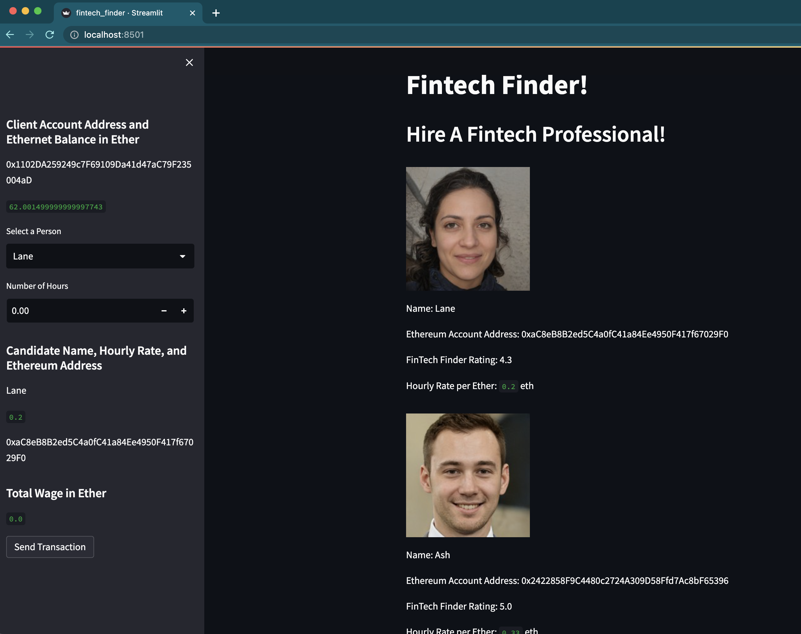

# FinTech Finder (Blockchain Payment System) - UW FinTech BootCamp Module 19 Challenge

This project is my blockchain payment app that uses [Ganache](https://trufflesuite.com/ganache/) and [Web3.py](https://web3py.readthedocs.io/en/v5/) to integrate Ethereum transactions to hire FinTech professionals.

The web UI is created using [Streamlit](https://streamlit.io/)

---

## Summary

Using Ganache, I create a personal Ethereum blockchain that the code connects to using Web3.py. With the Ethereum blockchain, transactions between the provided sample wallet addresses can be performed through the streamlit UI. 




---

## Technologies

This is a Python 3.7 project ran using the following dependencies:
1. [Pandas](https://github.com/pandas-dev/pandas) (1.3.5) - DataFrame objects
2. [Streamlit](https://streamlit.io/) (1.18.1) - Web interface

---

## Installation Guide

This project was ran using an [Anaconda](https://docs.anaconda.com/) dev environment but assuming you have Python installed you will likely also be able to run this app after installing the required dependencies with Pip: 

```Python
pip install pandas
pip install streamlit
```

The [requirements.txt](./Resources/requirements.txt) file in the Resources folder has the exact anaconda environment that I used in creating this project if you would like to copy it. 

Create a copy of the conda dev environment with `conda create --name myenv --file requirements.txt`

Then install the requirements with `conda install --name myenv --file requirements.txt`

---

## Usage

To run this app locally simply open a terminal window with this project as the main directory and type `streamlit run fintech_finder.py`. This will open the Streamlit web UI in your browser on localhost 8501. 

Caching is used to save any blockchain data that you use while running the app, however this data is lost after the session is over. 

---

## Contributors

[Ethan Silvas](https://github.com/ethansilvas)

---

## License

This project uses the [GNU General Public License](https://choosealicense.com/licenses/gpl-3.0/)